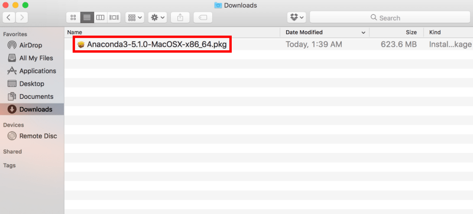
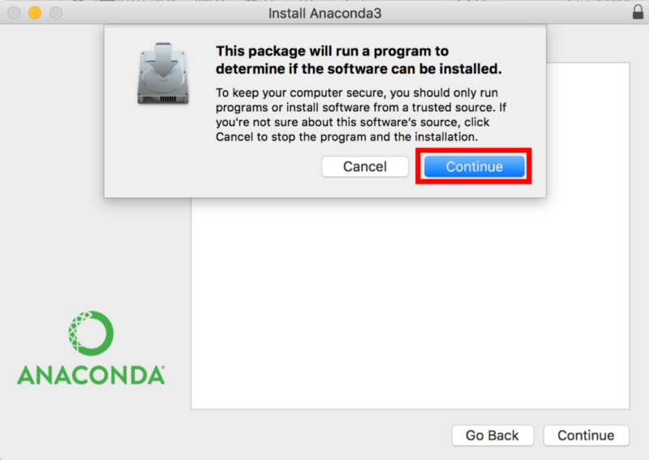
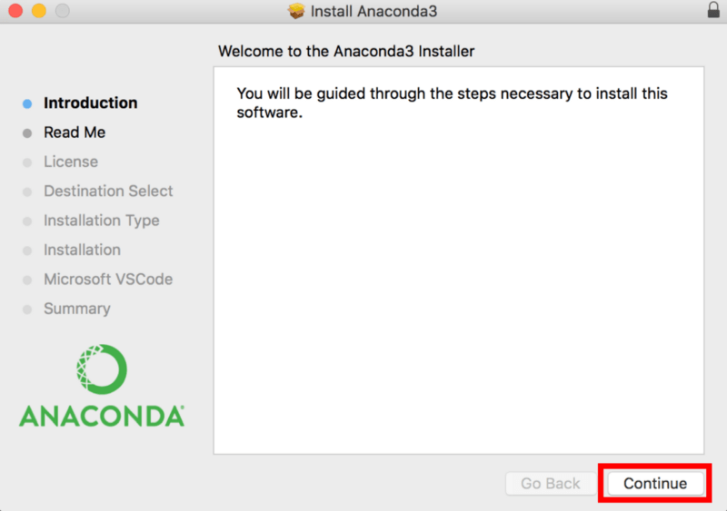

<p align="center">
    
</p>

# Python Bootcamp 2023

This repository contains the content for the Python Bootcamp 2023. The content is based on Alexander Hess's Intro to Python course on [YouTube](https://github.com/webartifex/intro-to-python) and Jake Vanderplas's Book: [Python Data Science Handbook](https://github.com/jakevdp/PythonDataScienceHandbook). This bootcamp is designed to be a quick introduction to Python and the Python ecosystem. We will cover the basics of Python and dive into applications of Python in Data Science. 

## How to use this repository?

This repo is designed to be downloaded and run locally on your computer. Just follow the quick setup instructions on this page and you should be good to go.

## Quick Setup

First off: you need to have Python 3.9 or higher installed on your computer. We can check this by opening a terminal and typing:

```
$ python --version
```

If you get an error message, you need to install Python.

> [!WARNING]  
> If you already have python installed and it's version 3.9 or higher, you should be fine. You can skip to the section Making sure you have git installed If you have an older version of Python installed, you can either update your Python version or create a new environment with Python 3.9 or higher. You can also install Anaconda and use it to manage your Python environments as well but remove any python references from your `.zshrc` files first. For managing multiple Python environments without Anaconda, I suggest reading the following [Medium article](https://medium.com/macoclock/how-to-install-and-manage-multiple-python-versions-on-macos-ca01a5e398d4). 

## Downloading Anaconda

For this bootcamp, we will be using the Anaconda distribution of Python (but you don't need to use it if you have a different version installed). Before you download the Anaconda distribution, you need to check if you have an Intel or M1(M2/M3) processor. 

1. Click on the Apple logo in the top left corner of your screen.

2. Select the "About This Mac" option at the top of the drop-down screen.

3. Locate the "Chip" or "Processor" heading. Your Mac's processor type will be displayed here.

You can download Anaconda [here](https://www.anaconda.com/download) (see below for the right versions). 

### Intel
Download the `64-bit Graphical Installer`

### M1(M2/M3)
Download the `64-bit (M1) Graphical Installer`

## Anaconda Installation
(follow the [instructions](https://www.datacamp.com/tutorial/installing-anaconda-mac-os-x) for installing Anaconda on your computer (also available below))

Once downloaded you can run the .pgk file and follow the instructions.




Click on Continue and follow the instructions. The default installation settings will work perfectly. Please know that when you install Anaconda, it modifies your bash profile with either anaconda3 or anaconda2 depending on what Python version you choose. This can be important for later.


Now we can test to verify that Anaconda is installed and working. Open a terminal and type:

```
$ conda --version
```

If all goes well you should see something like this:

```
conda 23.7.4
```

## Making sure you have GIT installed.

Git is a version control system that we will be using to download the content of this repository. To check if you have Git installed, open a terminal and type:

```
$ git --version
```

If you don't have Git installed, you should get a pop-up asking you to install `Developer Tools`. You can install the `Developer Tools` package and this is probably the easiest way to install git. The `Developer Tools` includes `xcode`, a common programming IDE on the Mac platform so the download could take a little while. Once it is done you need to reopen your terminal and type:

```
$ git --version
```

If you get a version number you're good to go. If you get an error message just reach out to me.


## Creating a project folder and downloading the repository

Now that we have Anaconda installed, we need to create a project folder. This is where we will store all of our code and data for this bootcamp and future projects. For ease of use, we will create this folder in our home directory.

1. Open a terminal and type:

```
$ cd ~
$ mkdir projects
$ cd projects
```

2. Now we need to download the content of this repository. In the same terminal, type:

```
git clone https://github.com/TicketSwap/python-bootcamp.git
```

If you are asked to provide a username and password you can just press enter for both. This will download the content of this repository into a folder called `python-bootcamp` in your `projects` folder.


## Create the Python environment

> [!NOTE]  
> **What is a Python environment?** A Python environment is a directory of files that contains everything you need to run a Python project. This includes the Python interpreter, the packages you need, and any other files you need to run your project. You can have multiple Python environments on your computer and each environment can have different versions of Python and different packages. This concept is crucial in Python development for several reasons:
> 
> ### 1. Isolation
> * **Explanation:** Each Python environment operates independently of others. This means that changes made in one environment, like installing a new library or updating a library version, do not affect other environments.
> * **Example:** Imagine you have two projects, Project A and Project B. Project A requires version 1.0 of a library, but Project B needs version 2.0. Using separate Python environments, you can manage these dependencies without conflict.
> ### 2. Consistency
> * **Explanation:** Environments ensure that a project runs consistently across different machines. This is because all dependencies required by a project are contained within its environment.
> * **Example:** If you're working on a team, all team members can use the same environment setup to ensure everyone has the same libraries and versions, making collaboration smoother.
> ### 3. Dependency Management
> * **Explanation:** Managing dependencies is easier and safer within a Python environment. You can upgrade, downgrade, or remove libraries without affecting the system-wide Python installation or other environments.
> * **Example:** If a new version of a library breaks your code, you can simply revert to the previous version within your environment without affecting other projects or system settings.

Now that we have the content of this repository downloaded, we need to create a Python environment. This environment will contain all of the packages we need for this bootcamp. To create the environment, open a terminal and type:

```
$ cd ~/projects/python-bootcamp
$ conda env create -n bootcamp python=3.11
```

> [!TIP]
> For future reference, you can create a new environment with the same command, but you need to change the name of the environment. For example, if you want to create a new environment called `test` with python version 3.9 you would type:
> ```
> $ conda env create -n test python=3.9
> ```

When prompted: please type `y` and press enter. This will create a new environment called `bootcamp` with Python version 3.11. This will take a few minutes to complete. Once it is done, we need to activate the environment. To do this, type:

```
$ conda activate bootcamp
```

You should see `(bootcamp)` at the beginning of your terminal prompt. This means that you are in the `bootcamp` environment. 

> [!TIP]
> To move between environments, you can use the `conda activate` command. For example, if you want to move to the `test` environment you would type:
> ```
> $ conda activate test
> ```
> To deactivate an environment, type:
> ```
> $ conda deactivate
> ```
> You can also use the `conda env list` command to see a list of all of your environments.

## Installing the dependencies
Now that we have the environment set up, we need to install the dependencies. To do this, make sure you have the `bootcamp` environment activated and type:

```
$ python -m pip install -r requirements.txt
```

# Starting Jupiter Lab
Now that we have everything installed, we can start Jupiter Lab. To do this, make sure you have the `bootcamp` environment activated and type:

```
$ jupyter lab
```

This will open a new tab in your browser with Jupiter Lab. If you've gotten this far you're good to go!


## License

### Code
The code in this repository, including all code samples in the notebooks listed above, is released under the [MIT license](LICENSE-CODE). Read more at the [Open Source Initiative](https://opensource.org/licenses/MIT).

### Text
The text content of the book is released under the [CC-BY-NC-ND license](LICENSE-TEXT). Read more at [Creative Commons](https://creativecommons.org/licenses/by-nc-nd/3.0/us/legalcode).
